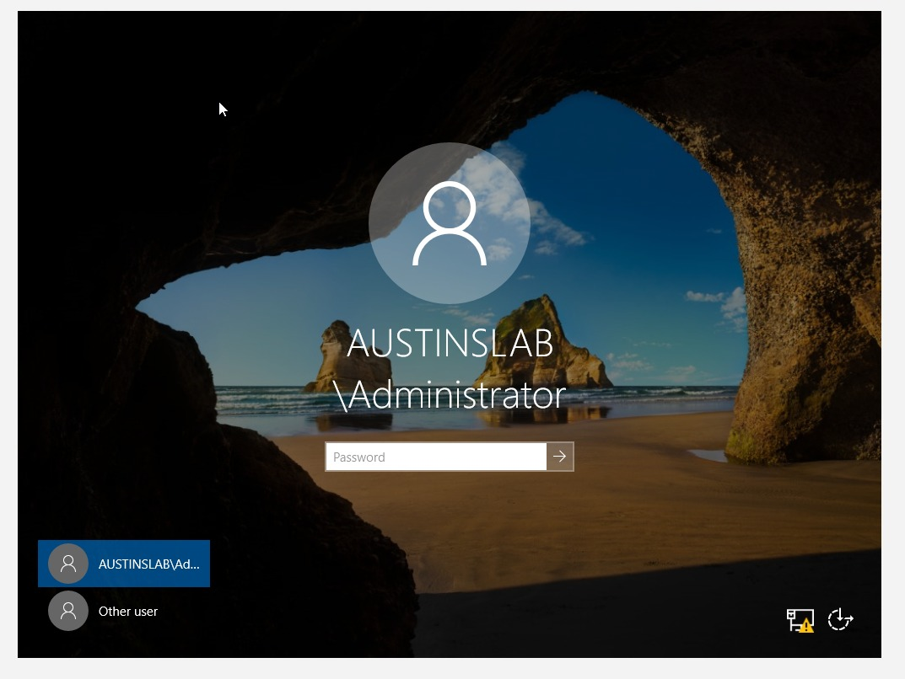
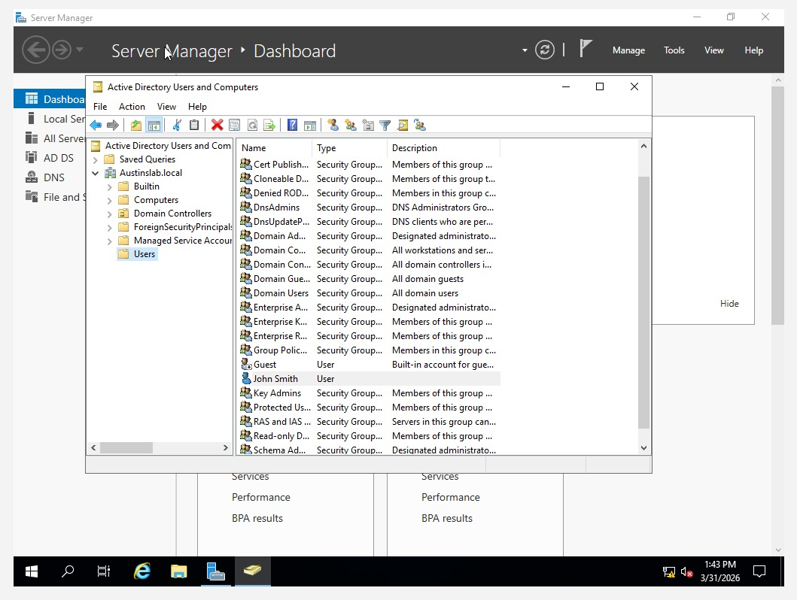
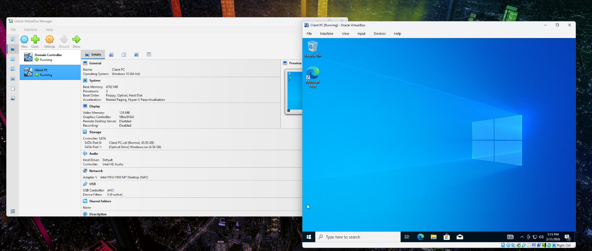
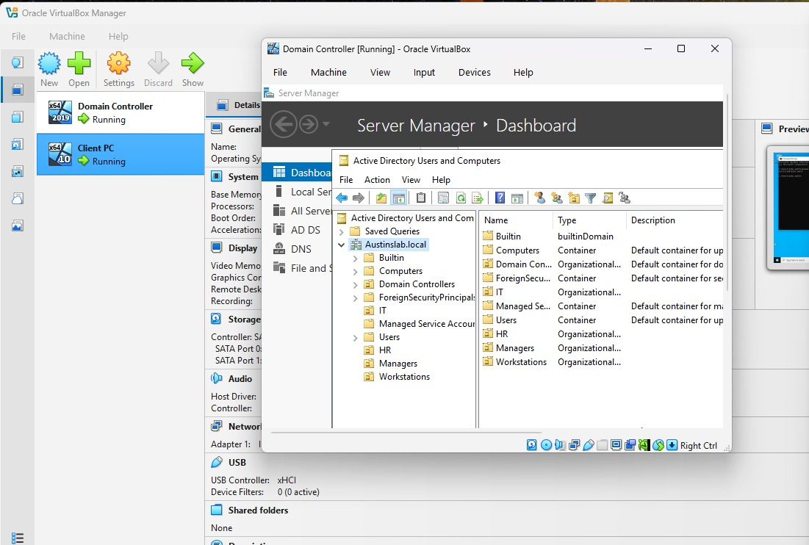
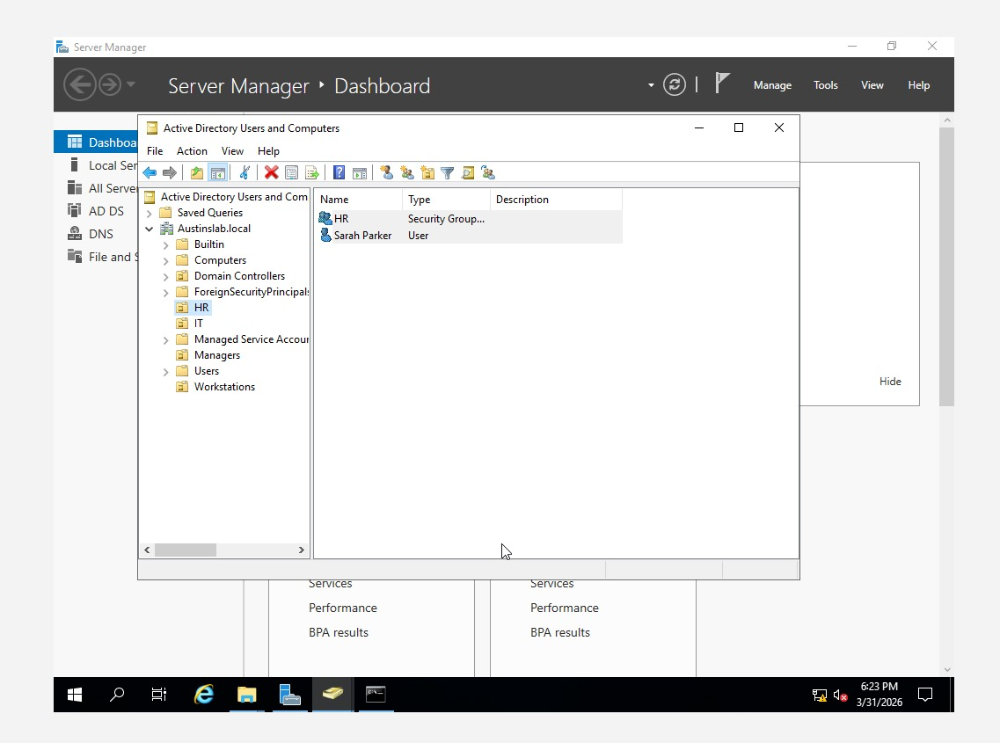
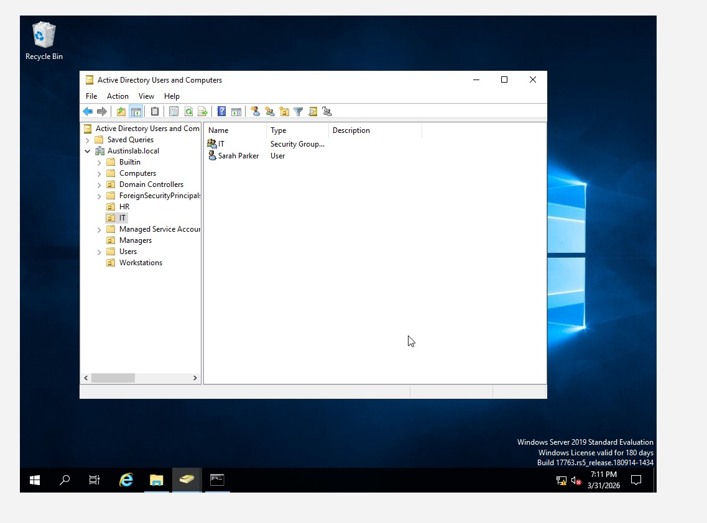

# Enterprise Active Directory Home Lab

## Project Overview
This lab demonstrates the end-to-end deployment of a Windows Server 2019 Domain Controller within a virtualized environment. The project covers infrastructure initialization, network configuration, and Identity & Access Management (IAM) within the `Austinslab.local` domain.

## Tools Used
- VirtualBox
- Windows Server 2019
- Windows 10
- Active Directory Domain Services (AD DS)
 Translating complex technical workflows into professional, audit-ready reports.\

---

## Project Goals & Real-World Application
In a corporate environment, Active Directory is the primary target for identity-based attacks. This lab demonstrates how to mitigate these risks using industry-standard security practices:

- **The "Default Password" Risk:**
    * **Action:** I enforced a "Must Change Password at Next Logon" policy for all new accounts.
    * **Real-World Benefit:** This ensures that "temporary" setup passwords are killed immediately. It prevents hackers from using leaked default credentials to gain initial access to the network.

- **The "Permission Creep" Risk:**
    * **Action:** I performed a **Group Move/Migration** to place a user into the correct departmental unit.
    * **Real-World Benefit:** When employees change roles, they often keep old permissions they no longer need. Moving them to the correct group ensures they have exactly what they need for their new role and *nothing else*, preventing unauthorized access.

- **The "Excessive Access" Risk:**
    * **Action:** I established a strict **Organizational Unit (OU)** hierarchy and assigned users to specific **Security Groups**.
    * **Real-World Benefit:** This applies the **Principle of Least Privilege (PoLP)**. If an account is compromised, the hacker is "trapped" in one department and cannot move laterally into sensitive Finance or Management systems.

- **The "Identity Blindness" Risk:**
    * **Action:** I used command-line tools like `whoami` and `net user` to audit active sessions and group memberships.
    * **Real-World Benefit:** This is a core security skill. If a system acts strangely, a Security Analyst uses these commands to verify if an unauthorized Admin or "Ghost User" has been created by a hacker to maintain control.

---

## Phase 1: Infrastructure & Domain Deployment
| Step | Administrative Task | Technical Documentation |
| :--- | :--- | :--- |
| 01 | VM Setup & Environment |  |
| 02 | Windows Server Installation |  |
| 03 | Active Directory Installation |  |
| 04 | Domain Controller Installed |  |
| 05 | Active Directory Window |  |
| 06 | Initial User Creation |  |

## Phase 2: Networking & Client Integration
| Step | Administrative Task | Technical Documentation |
| :--- | :--- | :--- |
| 07 | Windows 10 Client Install |  |
| 08 | Static IP & DNS Configuration |  |
| 09 | Endpoint Domain Join Success |  |

## Phase 3: Identity & Access Management (IAM)
| Step | Administrative Task | Technical Documentation |
| :--- | :--- | :--- |
| 10 | Domain User Configuration |  |
| 11 | OU Logical Structure (New OU) |  |
| 12 | HR Department User Creation |  |
| 13 | Password Reset Policy |  |
| 14 | User Migration (Group Move) |  |

---

## Skills Acquired
- **Infrastructure Deployment:** Installing and hardening Windows Server 2019 and AD DS roles.
- **Network Foundations:** Hardcoding Static IP and DNS settings to ensure stable communication.
- **IAM Mastery:** Provisioning users, managing security groups, and performing object migrations.
- **Security Auditing:** Verifying identity and access levels via Command Line Interface (CLI).

---
*For a full technical breakdown and configuration logs, see [notes/lab-notes.txt](notes/lab-notes.txt).*
