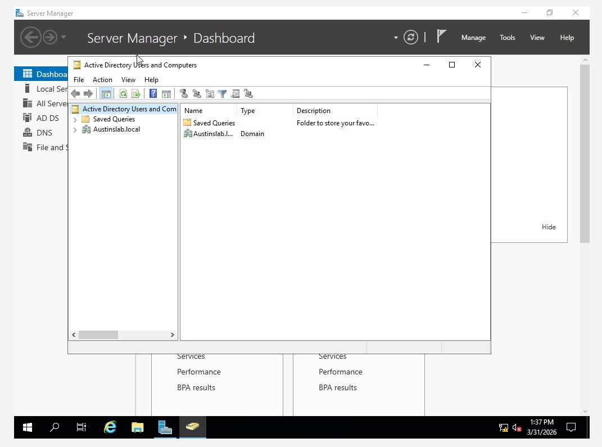
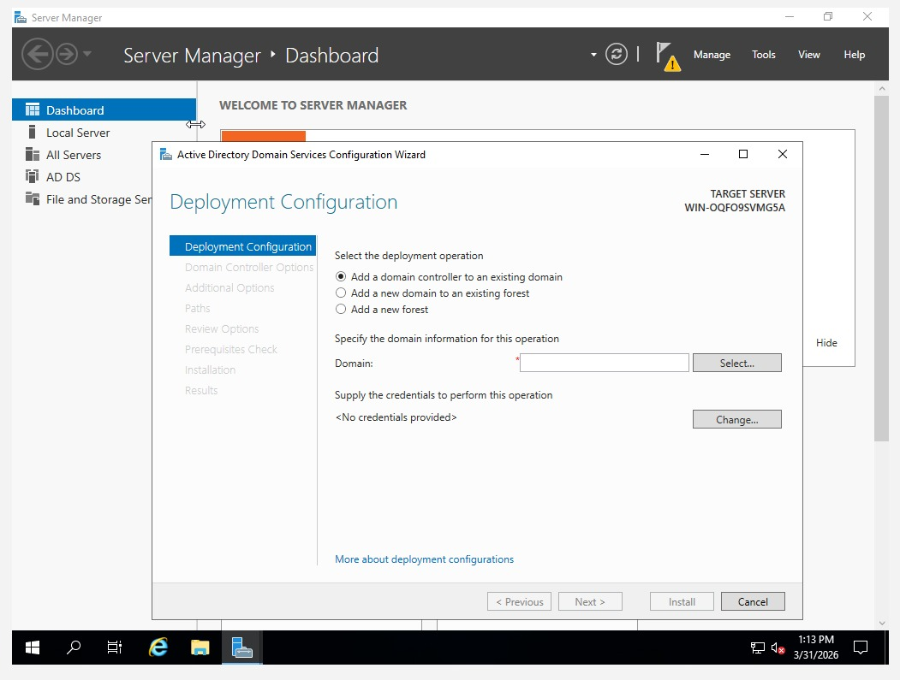
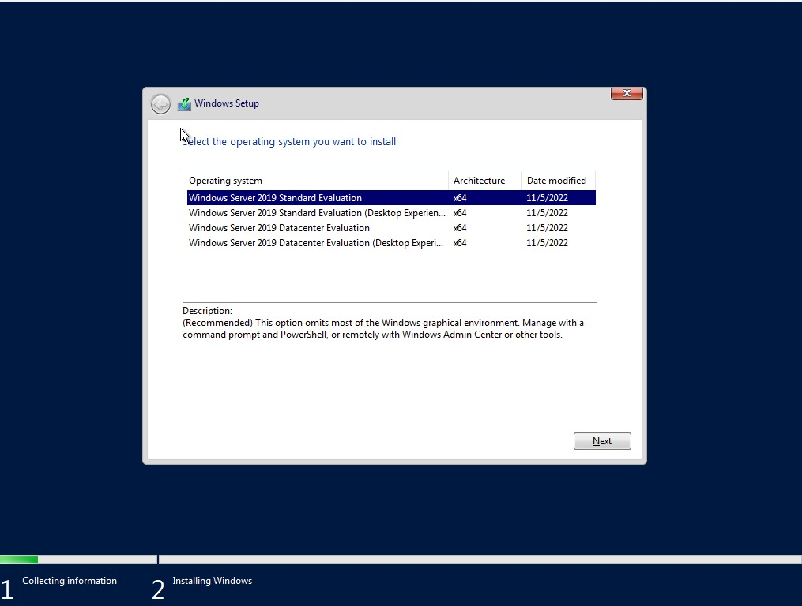
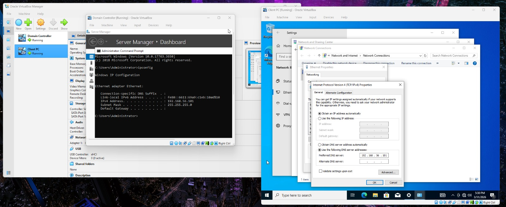
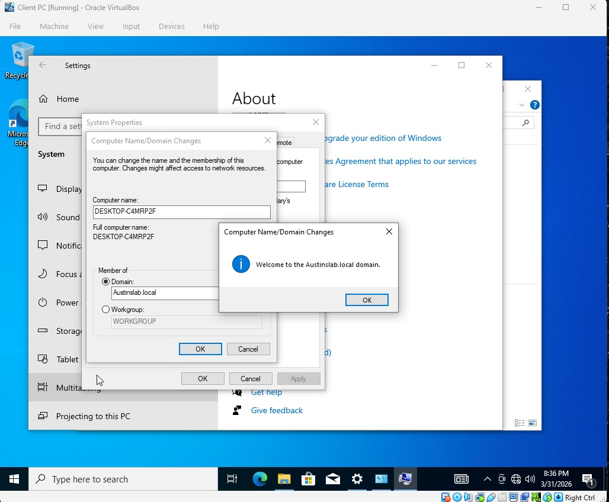
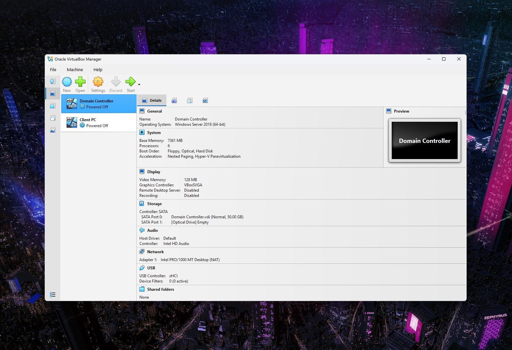
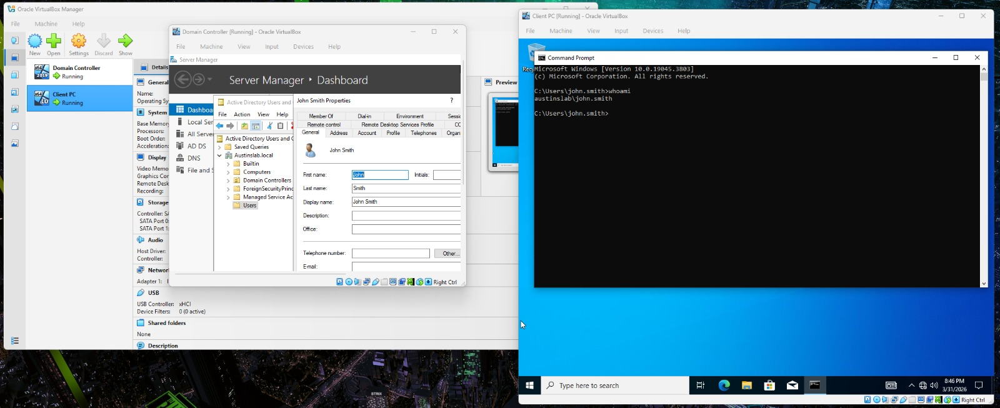
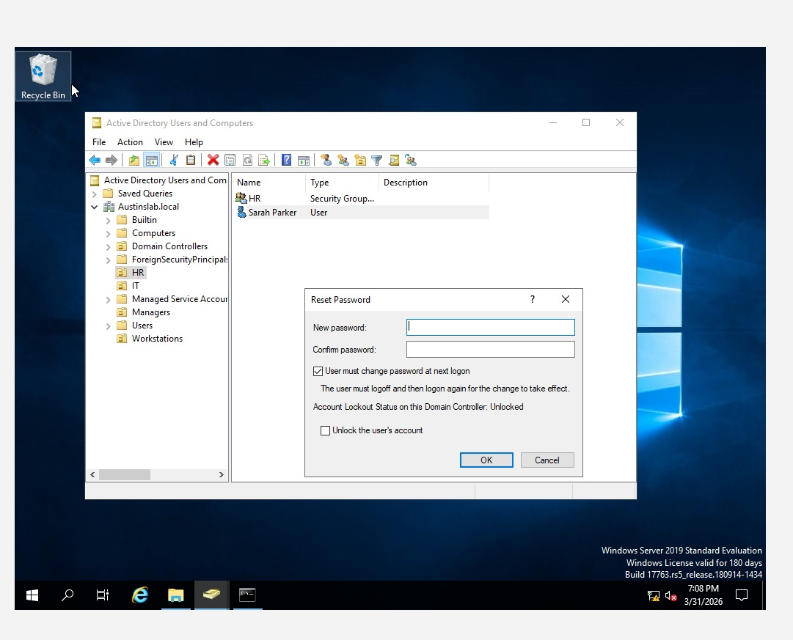

# Enterprise Active Directory Home Lab

## Project Overview
This lab demonstrates the end-to-end deployment of a Windows Server 2019 Domain Controller within a virtualized environment. The project covers infrastructure initialization, network configuration, and Identity & Access Management (IAM) within the `Austinslab.local` domain.

## Tools Used
- VirtualBox
- Windows Server 2019
- Windows 10
- Active Directory Domain Services (AD DS)

## Project Goals & Real-World Application
In a modern corporate, Active Directory is the primary target for identity-based attacks. This lab demonstrates how to mitigate these risks using industry-standard security practices:

- **The "Default Password" Risk:**
    * **Action:** I enforced a "Must Change Password at Next Logon" policy for all new users.
    * **Real-World Benefit:** This ensures that "temporary" setup passwords (like *P@ssword1*) are killed immediately. It guarantees that only the employee knows their "keys to the kingdom," preventing hackers from using leaked default credentials.

- **The "Excessive Access" Risk:**
    * **Action:** I established a strict **Organizational Unit (OU)** hierarchy and assigned users to specific **Security Groups** (HR, IT, Managers).
    * **Real-World Benefit:** This applies the **Principle of Least Privilege (PoLP)**. If an HR account is compromised, the hacker is "trapped" in the HR folder and cannot jump (move laterally) into the sensitive Finance or IT systems.

- **The "Server Spoofing" Risk:**
    * **Action:** I manually configured **Static IP addresses** and **DNS Resolver** settings for the Domain Controller and Client.
    * **Real-World Benefit:** Hardcoding these settings ensures that the workstation always talks to the *real* Server. This prevents "DNS Poisoning" or "Spoofing" attacks where a hacker tries to pretend to be the Server to steal user passwords.

- **The "Hidden Admin" Risk:**
    * **Action:** I used command-line tools like `whoami` and `net user` to audit active sessions and group memberships.

---

## Phase 1: Infrastructure & Domain Deployment
| Step | Administrative Task | Technical Documentation |
| :--- | :--- | :--- |
| 01 | Server Manager Dashboard |  |
| 02 | AD DS Role Deployment |  |
| 03 | Active Directory Forest Setup |  |
| 04 | Server Installation Progress |  |
| 05 | Active Directory Topology |  |
| 06 | Active Directory User Objects |  |

## Phase 2: Networking & Client Integration
| Step | Administrative Task | Technical Documentation |
| :--- | :--- | :--- |
| 07 | Static IP & DNS Configuration |  |
| 08 | Endpoint Domain Join Success |  |
| 09 | Domain Administrator Login |  |

## Phase 3: Identity & Access Management (IAM)
| Step | Administrative Task | Technical Documentation |
| :--- | :--- | :--- |
| 10 | OU Logical Structure |  |
| 11 | Security Group Management |  |
| 12 | Domain User Configuration |  |
| 13 | Identity Validation |  |
| 14 | Password Reset Policy |  |

---

## Skills Acquired
- **Enterprise Infrastructure:** Deploying and hardening Windows Server 2019 and AD DS roles.
- **Network Engineering:** Designing stable DNS/IP architecture for corporate environments.
- **IAM (Identity & Access Management):** Provisioning users, managing security groups, and enforcing GPO-style logic.
- **Technical Documentation:** Translating complex technical workflows into professional, audit-ready reports.
---
*For a full technical breakdown and configuration logs, see [notes/lab-notes.txt](notes/lab-notes.txt).*
